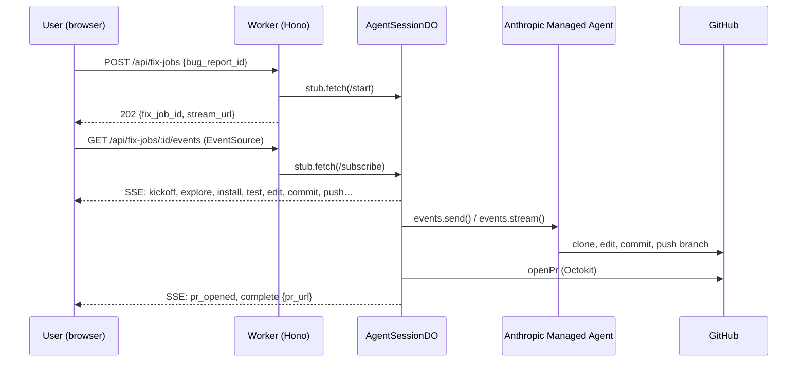

CrowdPatch

Community-sourced bugs. AI-shipped fixes. Powered by Claude Managed Agents on Opus 4.6 — every run lands as a real GitHub PR.

A developer ecosystem where bug reports become merged PRs — manually invoked, or autonomously and asynchronously, while you sleep.

What Is This?
CrowdPatch is a self-healing software commons. Developers upload their apps to a public square. The crowd stress-tests them, reports bugs, and earns currency in the form of credits. Uploaders spend their own currency to deploy Claude Managed Agents (running Opus 4.6 for reliable patch execution) to look at current bug reports, sandbox the codebase, diagnose the reported issues, and return verified patches as pull requests on GitHub.
It's a closed-loop economy where humans provide the signal and agents provide the labor, turning every dev project into an autonomous improvement channel. Every successful run is recorded as a real PR — durable artifacts you can review, merge, or use as evidence the agent shipped real work.

The Loop

Upload — Developer links a GitHub repo or uploads their app to CrowdPatch
Report — Community members test different user apps and file bug reports and earn currency credits
Earn — Testers receive currency credits for testing apps and even more currency credits when they report valid signals
CrowdPatch It - Uploader clicks button to "CrowdPatch It" (backed by Claude Managed Agents), spends currency credits to spawn Claude agents to diagnose and fix the reported bugs. Managed Agents enter a sandbox, diagnose, write the fix, open a PR
Ship — Developer reviews, merges, ships. App is permanently better.

Why It Matters
Every other AI coding tool on earth requires the developer to be in the loop — babysitting suggestions, approving diffs, reviewing output line by line. CrowdPatch inverts the whole model:

Solo-developer tools say: "Here's a smarter assistant."
CrowdPatch says: "Here's software that maintains itself."

The developer is no longer the bottleneck. The crowd becomes the QA team. The agent becomes the engineer. The human becomes the curator.

The Features

Asynchronous autonomy - fixes happen without the uploader present
Manual human-in-the-loop - fixes happen only when the uploader chooses
Managed Agent sandboxing — Claude (Opus 4.6) operates safely inside isolated codebases
Real PR artifacts — every successful run produces a reviewable, mergeable GitHub PR; no ephemeral output
Crowd-sourced signal — real human testers, not synthetic benchmarks
Native economy — Currency credits align incentives across reporters, fixers, and uploaders

The Vision

CrowdPatch is a bet on a future where software is a social act and maintenance is a shared ritual. We're building the first labor market where human judgment and agentic execution trade on equal footing.
Every app in CrowdPatch gets better every day. Every reporter earns their way in. Every agent gets smarter with every patch.
The crowd finds it. Claude fixes it. You ship it.

Built for the Built With Opus 4.7 Hackathon - where autonomy stopped being a feature and became a category.

~ crowdpatch.dev · Just CrowdPatch it. ~

---

## Demo evidence

Every run logged below is a real Pull Request CrowdPatch shipped against
[`semswitch-inc/jsdiff-demo`](https://github.com/semswitch-inc/jsdiff-demo)
during the hackathon — opened automatically by a Claude Managed Agent
(Opus 4.6) running this same codebase against the same `bug_001`. No
mocks, no fixtures.

- **Submission-day headline (2026-04-26):** [PR #14 — `[CrowdPatch] Fix: word-diff treats whitespace-only differences between tokens as real changes`](https://github.com/semswitch-inc/jsdiff-demo/pull/14) — surgical 1-line fix to `src/diff/word.ts` (`left === right` → `left.trim() === right.trim()`)
- **Auto-recovered run (2026-04-26):** [PR #13](https://github.com/semswitch-inc/jsdiff-demo/pull/13) — DO lost the upstream SSE pipe at +5min, the agent kept working and pushed the branch anyway, and `POST /api/fix-jobs/:id/recover` adopted the orphaned branch and opened the PR + recharged credits. Resilience receipt.
- **Earlier reference runs (2026-04-25):** [PR #12](https://github.com/semswitch-inc/jsdiff-demo/pull/12) · [PR #8](https://github.com/semswitch-inc/jsdiff-demo/pull/8) (clean 4.5 min) · [#11](https://github.com/semswitch-inc/jsdiff-demo/pull/11) · [#10](https://github.com/semswitch-inc/jsdiff-demo/pull/10) · [#9](https://github.com/semswitch-inc/jsdiff-demo/pull/9)
- **Full run history:** [`gh pr list --repo semswitch-inc/jsdiff-demo`](https://github.com/semswitch-inc/jsdiff-demo/pulls?q=is%3Apr+%5BCrowdPatch%5D)

The repeated whitespace-bug fixes across runs are intentional — each
demo replays the same `bug_001` to demonstrate that the agent reaches
the same correct fix every time. PRs #10 and #11 are deploy-smoke
runs against a different planted bug, proving the pipeline is
repo-agnostic.

Live demo: **[crowdpatch.dev/demo](https://crowdpatch.dev/demo)** · access code shared with judges via the submission form.

---

## Run it yourself in 10 minutes

CrowdPatch is open source (MIT). Anyone can self-host it against their own
GitHub repo with their own Anthropic + GitHub keys. The hosted product at
crowdpatch.dev is a deployment of this same codebase.

**Prerequisites**

- Node 20+
- An [Anthropic API key](https://console.anthropic.com/settings/keys)
- A GitHub fine-grained PAT scoped to the repo CrowdPatch will operate on
- `wrangler` CLI (`npm i -g wrangler`)

**1. Clone and install**

```bash
git clone https://github.com/semswitch-inc/crowdpatch
cd crowdpatch
npm install
```

**2. Configure secrets**

```bash
cp api/.dev.vars.example api/.dev.vars
# Edit api/.dev.vars: paste ANTHROPIC_API_KEY and GITHUB_DEMO_PAT.
cp web/.env.local.example web/.env.local
```

**3. Provision the local D1 database**

```bash
cd api
wrangler d1 create crowdpatch-db
# Paste the printed database_id into wrangler.toml
npm run db:migrate:local
npm run db:seed:local
```

**4. Provision the Managed Agent (one-shot, idempotent)**

```bash
npm run bootstrap:anthropic
# Paste the printed ANTHROPIC_AGENT_ID and ANTHROPIC_ENVIRONMENT_ID
# into api/.dev.vars, then restart wrangler dev.
```

**5. Run it**

```bash
# Terminal 1
cd api && npm run dev
# Terminal 2
cd web && npm run dev
```

Open `http://localhost:3000/demo` (the canonical demo entry — the root
path also works and redirects when given a `?bug=<id>` query) and click
the button. The agent will clone
[`semswitch-inc/jsdiff-demo`](https://github.com/semswitch-inc/jsdiff-demo),
fix the planted bug, and open a PR. Watch the live event log render
each step in real time.

> **Demo access code (optional in local dev)**: Mutating endpoints (POST
> `/api/apps`, `/api/bug-reports`, `/api/credits/claim`, `/api/fix-jobs`,
> `/api/fix-jobs/:id/recover`) are gated behind a shared
> `X-CrowdPatch-Demo-Code` header. The local frontend bypasses the prompt
> when `NEXT_PUBLIC_API_BASE` points at localhost, and the API bypasses the
> check when `DEMO_ACCESS_CODE` is unset AND `ENVIRONMENT=development` (the
> wrangler-dev defaults). To exercise the gate locally, set
> `DEMO_ACCESS_CODE=anything` in `api/.dev.vars`.

## Try it on your own repo

The agent prompt is repo-agnostic. To point CrowdPatch at any repo with a
test suite:

1. Pick a repo you have write access to. Plant a small bug (or use an
   existing failing test).
2. Edit `api/seeds/dev.sql`. Add an `apps` row with your repo URL plus
   `default_branch`, `setup_commands`, `test_commands`, and any
   `agent_notes` your toolchain needs (compiled outputs, mandatory
   rebuild steps, environmental fallbacks). Add one or more matching
   `bug_reports` rows.
3. Re-run `npm run db:seed:local` from the `api/` directory.
4. Visit `http://localhost:3000/demo?bug=YOUR_BUG_ID` (or
   `http://localhost:3000?bug=YOUR_BUG_ID` — same destination, the root
   path redirects to `/demo` when a `bug` query is present).
5. Watch the agent work in real time.

## Architecture



`AgentSessionDO` is one Durable Object instance per fix-job (keyed by
ULID via `idFromName`). It owns the Anthropic event iterator, persists
semantic events to its SQLite for replay-on-reconnect, and fans out
Server-Sent Events to N concurrent browser subscribers.

For the API service docs, see [`api/README.md`](./api/README.md).

## Deploy your own CrowdPatch on Cloudflare

CrowdPatch is open source under MIT. To deploy your own instance against
your own Cloudflare account + Anthropic + GitHub credentials:

**Prerequisites**

- A Cloudflare account on the Workers Paid plan (Durable Objects + the
  5 min CPU limit require it; ~$5/month).
- An Anthropic API key with access to Claude Opus 4.6 / Managed Agents
  beta.
- A GitHub fine-grained PAT scoped to the repo CrowdPatch will operate
  on (Contents R/W, Pull requests R/W, Issues Read).
- `wrangler` 4.x logged in to your account: `npx wrangler login`.

**1. Provision D1**

```bash
cd api
npm run db:create
# Copy the printed `database_id = "..."` value into `api/wrangler.toml`,
# REPLACING the committed placeholder. (The committed ID is the demo
# instance — your account cannot use it.)
```

**2. Provision R2**

```bash
npm run r2:create
# Bucket binding `ARTIFACTS` and bucket name `crowdpatch-artifacts` are
# already wired in wrangler.toml.
```

**3. Apply migrations + seed (remote)**

```bash
npm run db:migrate:prod
npm run db:seed:prod
# Seed inserts the demo user + apps + bug_reports for jsdiff-demo.
# Edit `api/seeds/dev.sql` first if you want to point at your own repo.
```

**4. Set Worker secrets**

```bash
npx wrangler secret put ANTHROPIC_API_KEY
npx wrangler secret put GITHUB_DEMO_PAT
# REQUIRED in production — gates mutating endpoints (apps, bug-reports,
# credits/claim, fix-jobs, fix-jobs/:id/recover) behind the
# X-CrowdPatch-Demo-Code header. Without this, those endpoints return
# 503 demo_code_not_configured (fail-closed). Pick any value and share
# it with judges/testers.
npx wrangler secret put DEMO_ACCESS_CODE
# Optional — the production wrangler.toml default is "production", which
# disables the /debug/anthropic-agents route. Override if you want it on:
npx wrangler secret put ENVIRONMENT
```

**5. Bootstrap the Managed Agent**

```bash
# bootstrap:anthropic reads api/.dev.vars (NOT Worker secrets) for the
# Anthropic key, so create that file first if you skipped local dev:
cp .dev.vars.example .dev.vars
# Edit .dev.vars and fill ANTHROPIC_API_KEY (only that line is needed
# for bootstrap; the rest can stay as REPLACE_ME).

npm run bootstrap:anthropic
# Idempotent. Prints ANTHROPIC_AGENT_ID + ANTHROPIC_ENVIRONMENT_ID.
# Set both as Worker secrets:
npx wrangler secret put ANTHROPIC_AGENT_ID
npx wrangler secret put ANTHROPIC_ENVIRONMENT_ID
```

**6. Configure the API host (one of two options)**

- **Subdomain on workers.dev (default, no DNS setup):** comment out the
  `routes = [...]` block in `api/wrangler.toml` — your Worker will publish
  to `crowdpatch-api.<your-subdomain>.workers.dev`.
- **Custom domain:** replace the pattern in `routes = [...]` with your
  own zone (zone must already be in your CF account). Then update the
  CORS allowlist near the top of `api/src/index.ts` to include your
  frontend origin(s).

**7. Deploy the API**

```bash
cd api
npx wrangler deploy
```

**8. Deploy the web**

```bash
cd web
cp .env.production.local.example .env.production.local
# Edit .env.production.local and set NEXT_PUBLIC_API_BASE to your API
# URL (workers.dev subdomain or your custom domain).
npm run deploy
# Pushes a static export to Cloudflare Pages under project name
# `crowdpatch-web`. First deploy will prompt you to create the project.
```

**Done.** Open your Pages URL → click the demo button → the agent will
fix the seeded bug in your repo and open a PR.

## Hosted version

A managed deployment at [crowdpatch.dev](https://crowdpatch.dev) runs
this same codebase against the demo target. Until SaaS layer (auth,
billing, multi-tenant projects) lands, self-hosting via the steps above
is the canonical way to point CrowdPatch at your own repos.

## License

MIT — see [LICENSE](./LICENSE). All dependencies are OSS-compatible.
