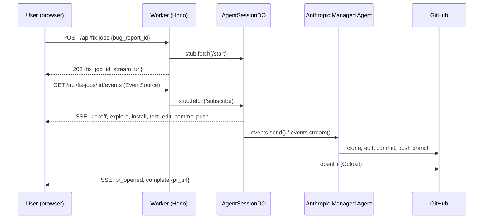

CrowdPatch

Community-sourced bugs. AI powered fixes. Powered by Claude Managed Agents.

A developer ecosystem where bug reports become merged PRs — manually invoked, or autonomously and asynchronously, while you sleep.

What Is This?
CrowdPatch is a self-healing software commons. Developers upload their apps to a public square. The crowd stress-tests them, reports bugs, and earns currency in the form of credits. Uploaders spend their own currency to deploy Claude Managed Agents to look at current bug reports, sandbox the codebase, diagnose the reported issues, and return verified patches as pull requests.
It's a closed-loop economy where humans provide the signal and agents provide the labor, turning every dev project into an autonomous improvement channel.

The Loop

Upload — Developer links a GitHub repo or uploads their app to CrowdPatch
Report — Community members test different user apps and file bug reports and earn currency credits
Earn — Testers receive currency credits for testing apps and even more currency credits when they report valid signals
CrowdPatch It - Uploader clicks button to "CrowdPatch It" (backed by Claude Managed Agents), spends currency credits to spawn Claude agents to diagnose and fix the reported bugs. Managed Agents enter a sandbox, diagnose, write the fix, open a PR
Ship — Developer reviews, merges, ships. App is permanently better.


Why It Matters
Every other AI coding tool on earth requires the developer to be in the loop — babysitting suggestions, approving diffs, reviewing output line by line. CrowdPatch inverts the whole model:

Solo-developer tools say: "Here's a smarter assistant."
CrowdPatch says: "Here's software that maintains itself."

The developer is no longer the bottleneck. The crowd becomes the QA team. The agent becomes the engineer. The human becomes the curator.

The Features

Asynchronous autonomy - fixes happen without the uploader present
Manual human-in-the-loop - fixes happen only when the uploader chooses
Managed Agent sandboxing — Claude operates safely inside isolated codebases
Crowd-sourced signal — real human testers, not synthetic benchmarks
Native economy — Currency credits align incentives across reporters, fixers, and uploaders

The Vision

CrowdPatch is a bet on a future where software is a social act and maintenance is a shared ritual. We're building the first labor market where human judgment and agentic execution trade on equal footing.
Every app in CrowdPatch gets better every day. Every reporter earns their way in. Every agent gets smarter with every patch.
The crowd finds it. Claude fixes it. You ship it.

Built for the Built With Opus 4.7 Hackathon - where autonomy stopped being a feature and became a category.

~ crowdpatch.ai · Just CrowdPatch it. ~

---

## Run it yourself in 10 minutes

CrowdPatch is open source (MIT). Anyone can self-host it against their own
GitHub repo with their own Anthropic + GitHub keys. The hosted product at
crowdpatch.ai is a deployment of this same codebase.

**Prerequisites**

- Node 20+
- An [Anthropic API key](https://console.anthropic.com/settings/keys)
- A GitHub fine-grained PAT scoped to the repo CrowdPatch will operate on
- `wrangler` CLI (`npm i -g wrangler`)

**1. Clone and install**

```bash
git clone https://github.com/semswitch-inc/crowdpatch
cd crowdpatch
npm install
```

**2. Configure secrets**

```bash
cp api/.dev.vars.example api/.dev.vars
# Edit api/.dev.vars: paste ANTHROPIC_API_KEY and GITHUB_DEMO_PAT.
cp web/.env.local.example web/.env.local
```

**3. Provision the local D1 database**

```bash
cd api
wrangler d1 create crowdpatch-db
# Paste the printed database_id into wrangler.toml
npm run db:migrate:local
npm run db:seed:local
```

**4. Provision the Managed Agent (one-shot, idempotent)**

```bash
npm run bootstrap:anthropic
# Paste the printed ANTHROPIC_AGENT_ID and ANTHROPIC_ENVIRONMENT_ID
# into api/.dev.vars, then restart wrangler dev.
```

**5. Run it**

```bash
# Terminal 1
cd api && npm run dev
# Terminal 2
cd web && npm run dev
```

Open `http://localhost:3000` and click the button. The agent will clone
[`semswitch-inc/jsdiff-demo`](https://github.com/semswitch-inc/jsdiff-demo),
fix the planted bug, and open a PR. Watch the live event log render
each step in real time.

## Try it on your own repo

The agent prompt is repo-agnostic. To point CrowdPatch at any repo with a
test suite:

1. Pick a repo you have write access to. Plant a small bug (or use an
   existing failing test).
2. Edit `api/seeds/dev.sql`. Add an `apps` row with your repo URL plus
   `default_branch`, `setup_commands`, `test_commands`, and any
   `agent_notes` your toolchain needs (compiled outputs, mandatory
   rebuild steps, environmental fallbacks). Add one or more matching
   `bug_reports` rows.
3. Re-run `npm run db:seed:local` from the `api/` directory.
4. Visit `http://localhost:3000?bug=YOUR_BUG_ID`.
5. Watch the agent work in real time.

## Architecture



`AgentSessionDO` is one Durable Object instance per fix-job (keyed by
ULID via `idFromName`). It owns the Anthropic event iterator, persists
semantic events to its SQLite for replay-on-reconnect, and fans out
Server-Sent Events to N concurrent browser subscribers.

For the API service docs, see [`api/README.md`](./api/README.md).

## Hosted version

A managed deployment at [crowdpatch.ai](https://crowdpatch.ai) is in the
works — same engine, plus the SaaS layer (auth, billing, multi-tenant
projects). Until then, self-hosting is the canonical way to use it.

## License

MIT — see [LICENSE](./LICENSE). All dependencies are OSS-compatible.