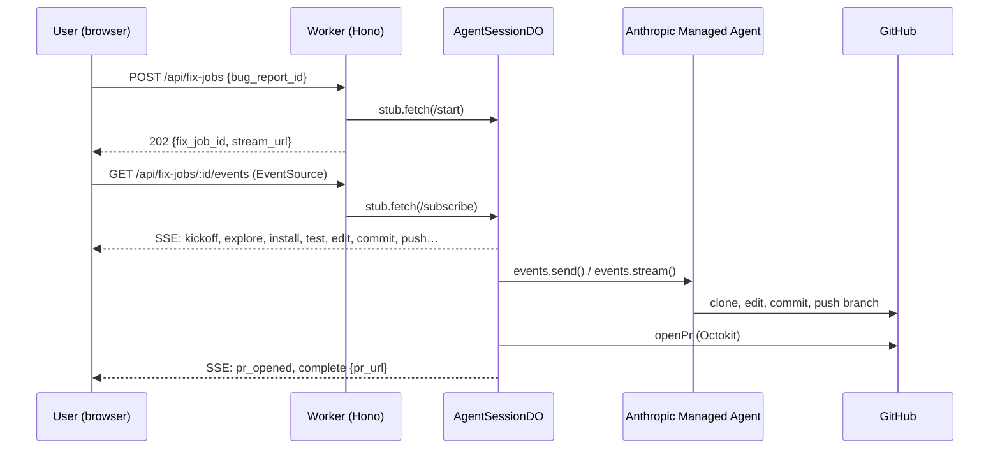

# Architecture

`AgentSessionDO` is one Durable Object instance per fix-job (keyed by
ULID via `idFromName`). It owns the Anthropic event iterator, persists
semantic events to its SQLite for replay-on-reconnect, and fans out
Server-Sent Events to N concurrent browser subscribers.

## Components

| Component | Path | Role |
|---|---|---|
| **Worker entry** | `api/src/index.ts` | Hono app, CORS, DO export, route mounting |
| **Fix-job routes** | `api/src/routes/fixJobs.ts` | POST + GET handlers, dedupe window, hand-off to DO |
| **Agent session DO** | `api/src/durable_objects/agentSession.ts` | Multiplexes one Anthropic session to N SSE subscribers; persists semantic events to per-instance SQLite |
| **Agent prompt** | `api/src/lib/agentPrompt.ts` | `buildAgentPrompt(app, bugReport, branch)` — repo-agnostic system prompt |
| **Event mapper** | `api/src/lib/eventMapper.ts` | Anthropic raw events → semantic `Card` payloads |
| **Anthropic client** | `api/src/lib/anthropic.ts` | SDK setup, session helpers |
| **GitHub helper** | `api/src/lib/github.ts` | Octokit wrapper, branch + PR helpers |
| **Artifacts** | `api/src/lib/artifacts.ts` | R2 evidence-bundle writer (best-effort, non-blocking) |
| **Demo gate** | `api/src/lib/demoCode.ts` | `X-CrowdPatch-Demo-Code` middleware |

## Data layer

- **D1** (`api/migrations/`, `api/seeds/dev.sql`) — users, apps, bug_reports,
  fix_jobs, credit ledger.
- **R2** (`crowdpatch-artifacts` bucket) — durable per-fix-job evidence
  bundle: `submitted-bug.json`, `agent-prompt.txt`, `run-summary.json`,
  `pr-metadata.json`, `agent-reply-tail.txt` under
  `fix-jobs/<fix_job_id>/`. Writes are best-effort and isolated per file —
  an R2 outage never blocks the run, the PR, or the SSE terminal event.
- **DO SQLite** — per-fix-job semantic event log for SSE replay-on-reconnect.

## SSE wire contract

`AgentSessionDO` emits one of these `event:` names per message — every
event carries a JSON payload matching `src/lib/eventMapper.ts` `Card`:

- **Progress:** `kickoff`, `explore`, `install`, `test`, `read`, `edit`,
  `commit`, `push`, `thought`, `pr_opened`
- **Terminal:** `complete` (success — payload includes `pr_url`) or
  `error_event` (terminal failure — payload includes `ended_reason`)
- Comment lines `:heartbeat\n\n` every 15s to keep proxies/browsers from
  idling out

The browser closes the EventSource on either terminal event. Native
EventSource `error` events (transport-level network blips) are
auto-reconnected by the browser and are NOT terminal.

## Resilience: the recover path

`POST /api/fix-jobs/:id/recover` is the manual escape hatch for cases
where the DO died at the +5min CPU limit but the agent kept working and
pushed its branch anyway. The handler:

1. Looks up the fix-job's expected branch name on GitHub.
2. If the branch exists and the DO recorded `agent_no_push`, opens the
   PR, marks success, and re-charges the credit (it had been refunded
   on the false-fail).
3. If past the cutoff window with no branch, marks `agent_no_push`
   permanently and refunds the credit.

PR #13 in [`semswitch-inc/jsdiff-demo`](https://github.com/semswitch-inc/jsdiff-demo/pull/13)
is a real recover-path receipt from submission day.

## Further reading

- [`api/README.md`](../api/README.md) — service-level reference: routes
  table, demo-code matrix, layout tree.
- [`web/README.md`](../web/README.md) — frontend (Next.js 16) dev notes.
- [BYO_PUSH.md](./BYO_PUSH.md) — the Vault + GitHub MCP pattern that lets
  user-supplied PATs author commits.
- [AGENT_BOOTSTRAP.md](./AGENT_BOOTSTRAP.md) — Managed Agent provisioning
  and model selection.
